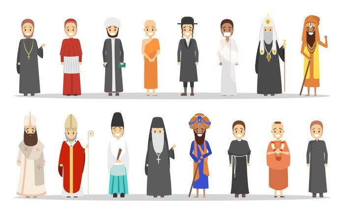

```{r setup, include=FALSE}
knitr::opts_chunk$set(echo = TRUE)
```

#### _Under contract at Princeton University Press_ ####

``` {r, echo=FALSE, out.width= "100%", out.extra='style="float:center; padding:10px"'}

```

<details>
<summary>
<b>Book Abstract</b>
</summary>
<p>This book argues that inter-group conflict between natives and immigrants can be decreased through shared social norms that define a common ingroup identity. Anti-immigrant bias is a form of ethnic conflict driven mainly by cultural differences. These differences create “social distance” between natives and immigrants, leading to bias and discrimination. The usual prescription to reduce bias via reducing social distance has been to change the expression of ascriptive differences that categorize immigrants as an outgroup relative to the native ingroup: immigrants will often change their names, their customs, their language, and even their religion. This process, often pursued by policies of coercive assimilation of immigrant populations, changes group boundaries to forge a degree of homogeneity that is thought to be required to reduce intergroup conflict. This book argues that it is not necessary for immigrants to change their appearance, their religion, or their language in an attempt to “pass” as members of the majority. Rather, bias and discrimination toward immigrants can be reduced if immigrants and natives share social norms that define a common ingroup identity as citizens.

The key here is that norms must be shared — not that the burden must necessarily be on immigrants to adopt to local norms that they find repressive. Although norm-sharing will often take place through a process of assimilation of minority groups into majority populations, it could also occur via a gradual, two-way process of mutual acculturation over time. In the short term, one strategy to overcome sources of bias and discrimination is to resolve uncertainty about the depth of ideational differences that divide natives and immigrants. This book shows that, when natives observe immigrant behavior that suggests that the two groups share valued civic norms, this reduces discrimination by de-emphasizing the native-immigrant divide and forging a common ingroup identity that includes both natives and immigrants. Different shared identities can be defined by different norms; and the more salient is that identity to each individual’s self-concept, the more discrimination toward immigrants will be reduced. This conclusion speaks to an ongoing debate about the limits of multiculturalism in Europe. Our book suggests that multiculturalism is possible, but that it also has its limits. It is possible to reduce discrimination due to differences in ascriptive traits, but this requires sharing norms and ideas, which would eliminate the symbolic threat generated by ascriptive differences.</p>
</details>


