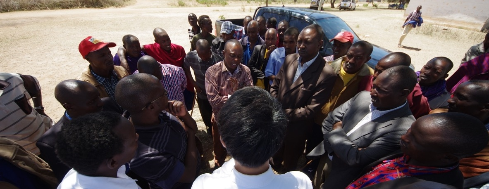

```{r setup, include=FALSE}
knitr::opts_chunk$set(echo = TRUE)
```

#### Winner, __Juan Linz Prize__ for the Comparative Study of Democracy, Democracy & Autocracy Section, APSA, 2020 ####

``` {r, echo=FALSE, out.width= "100%", out.extra='style="float:center; padding:10px"'}

```

<details>
<summary>
<b>Book Abstract</b>
</summary>
<p>This book project explores the conditions under which political parties can undermine the representation of citizen interests in new democracies. Conventional wisdom has emphasized the centrality of parties in mediating the relationship between voters and politicians, attributing the representational deficit observed across the developing world to the lack of stable partisan attachments or the ephemeral nature of political parties. I show that this may not be the case. To the contrary, political parties and their leaders can capitalize on their electoral dominance in local elections and authority over intraparty candidate selection institutions to sever the connection between voters and their representatives.

I employ a multi-method research strategy that brings together qualitative, quantitative, and experimental evidence based on 18 months of fieldwork in Kenya. To first establish that African parties often hold a monopoly on local power, I combine insights from more than 70 politician interviews and analyses of nationally representative surveys and constituency-level electoral returns across six African democracies. Drawing on a qualitative case study of political party organization in Kenya and a series of experiments conducted among 3,000 partisan primary voters, I also show that party leaders possess both institutional power and the persuasive influence over partisans to command control over the candidate selection process. Finally, I use supervised machine-learning methods on a large text corpus of more than 51,000 newspaper articles on Kenyan politicians to document the existence of a nomination tournament in which party leaders select candidates that focus on “party-oriented” activities, rather than “constituency-oriented” activities that would benefit their constituents.

Substantively, these findings contribute to the emerging consensus that democratic elections are necessary but insufficient to foster better representation and responsiveness for the people. However, while the dominant narrative in comparative politics has focused on structural-institutional factors such as ethnicity, clientelism, or electoral systems to understand this deficit, I shift the attention back to political parties. My project shows that the ideal of “representative democracy” is likely to remain elusive unless democracy within political parties is realized. When power and authority over party institutions and decision-making processes accumulate to a single individual or a small group of elites, these actors have the potential to effectively become “autocrats” within their domain; manipulating elected representatives who should primarily be interested in tending to their constituents to serve their political ambitions, thereby derailing the democratic process that they should protect.</p>
</details>


